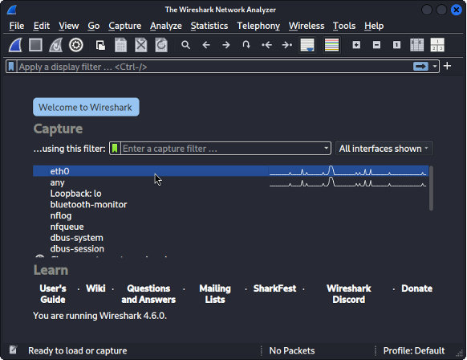
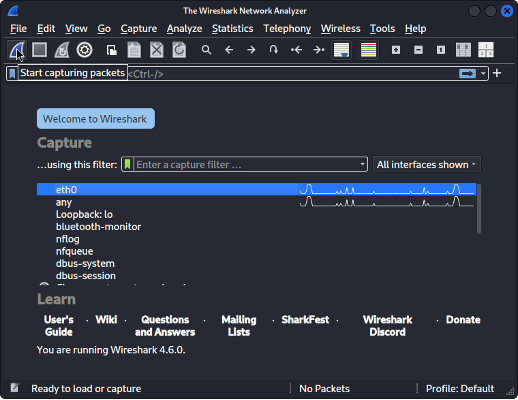
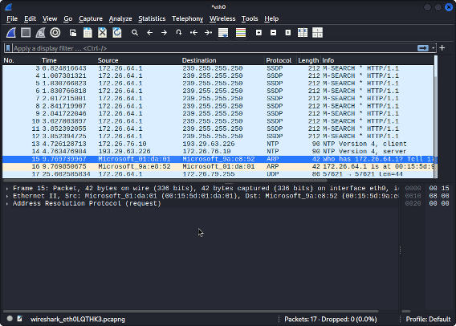
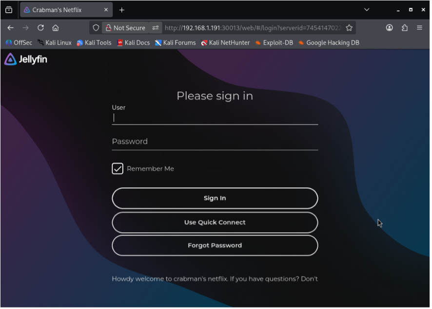
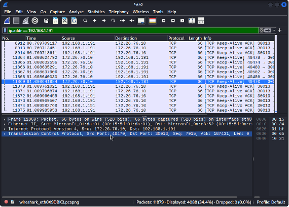
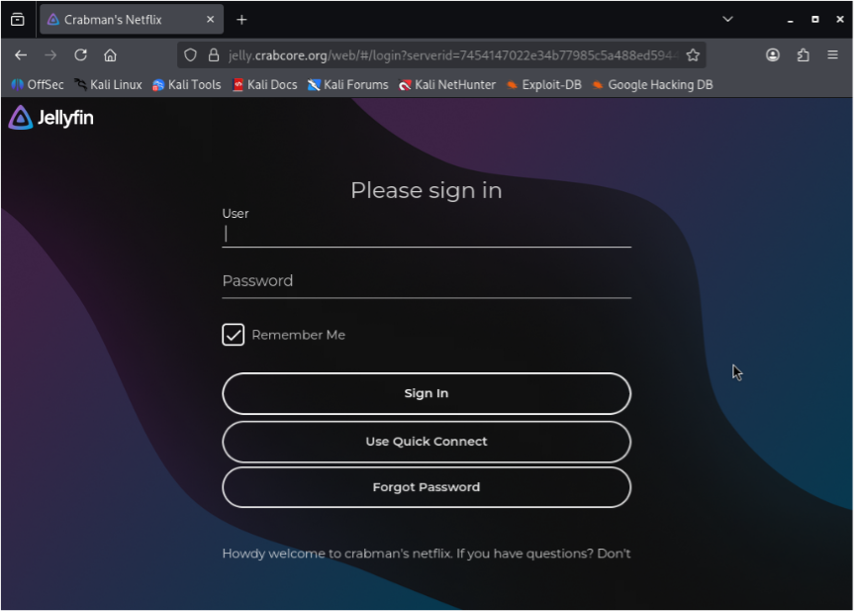
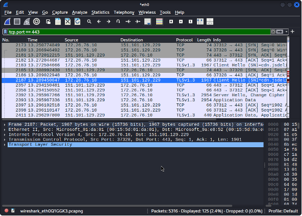

# Defensive Network Traffic Analysis Using Wireshark: A Comparison of Local and Cloudflare-Tunneled Services

Robert Ramsey  
P. Lynn Boyér  
CTI-120-E130 - Network & Sec Foundations  
4 February 2026  

> This project was made as a midterm project for CTI-120-E130.

This tutorial shows you defenders can use Wireshark to understand how network traffic is when the same service is accessed locally versus through a secure Cloudflare tunnel.

## What is Wireshark?

What is Wireshark? It’s a free tool that lets you list on your network to see everything that’s currently happening. People that use it range from people that want to learn about networking and have basis on how protocols work. Then there’s pen tester’s (penetration testing) they analyze the traffic during their test. It helps monitor live/real time traffic to see suspicious or hidden attacks. You also see exactly what the packets are doing and not just summaries, but you can also troubleshoot the alerts or problems quickly. In short basically it turns network traffic into something you can see visually and see the actual problem.

We’ve covered the basics of how networks and security work, including what Wireshark does at a foundational level. Today’s networks are different than what they were a bit ago. Almost everything is encrypted with HTTPS. Wireshark sees who is talking to who and how much data, but not what’s inside those packets. Lots of traffic on websites and platforms goes through a cloud service like Cloudflare. When you’re connecting to the website first 90% percent of the time its going through Cloudflare not straight to the website. Your device sees a Cloudflare IP not the actual server’s.

In this tutorial, I will show you what traffic and what the data looks like when directly connecting to the servers IP (192.168.x.x). Then I’ll show you connecting to using a normal looking URL (jelly.crabcore.org) which is routed a Cloudflare tunnel, that’s going to show us a Cloudflare IP not my servers IP. In short, I’m showing you what direct connections look like versus Cloudflare. We must look at patterns not clear destinations.

Hopefully by seeing what I’m showing you here today you see what it looks like when directly connecting to a local URL vs Cloudflare today. What we/defenders can still see is who is connecting, how much data is being delivered, connection timing and patterns and sometimes a domain name. You’re probably wondering if it matters. Modern services like Cloudflare hide the real destination to make things safer and faster for people.

## Lab Environment and Requirements

### Lab Environment (What I used)

I’m going to be using the operating system “Kali Linux” in a virtual environment with Wireshark. It’s all going to be on the same local network so my VM and other devices and can talk to each other directly through my services I host.

### Network Setup

In this lab Kali and the service are on the same local network. We’re going to be reaching the same service using private IP (192.168.x.x.) that’s going straight to my server.

Then were going to go through my public looking domain. Showing how it’ll go from Kali then to Cloudflare before it finally reaches my server. Both methods are connected to the same service I host. Just going to be accessed two different ways and Wireshark will show us how it’s different.

### Requirements for Others

What if you don’t have the same equipment as me? That’s fine all you need is your computer and some storage. What you will need to do is install Wireshark on your computer. Then a local service like your router’s login page, you may have to look your router for a sticker or you can try either (192.168.0.1, 192.168.1.1.). Then for a website that uses Cloudflare. You can use Discord or Patreon.

## Wireshark Traffic Capture Demonstration

### Capturing Local Network Traffic

#### Figure 1 Wireshark interface displaying network adapters

When you open Wireshark for the first time you’re going to see all these options. You’re going to need to choose your network adapter before starting capture. In this instance eth0 was used.

#### Figure 2 Wireshark interface showing shark fin icon to start.

To start capturing packets you’re going to want to press the shark fin as seen in Figure 2.

#### Figure 3 Wireshark interface showing real time packet capturing.

What you’re currently looking at is what your networking is basically doing in background before connecting to any specific. You don’t do anything here.

#### Figure 4 Accessing Local URL.

While you’re capturing packets you’ll want to go your local IP address that you have wrote down but for me in this photo in my media server.

#### Figure 5 Wireshark packet capture showing direct local network traffic to a private IP address.

This picture shows the destination IP address, demonstrating direct network visibility before using any cloud protection service. When you want to filter the traffic down you will type in:

ip.addr == 192.168.x.x

#### Figure 6 Accessing the same service through a Cloudflare URL.

This screenshot creates Cloudflare HTTPS traffic to compare earlier to the local connection.

#### Figure 7 Wireshark capture displaying HTTPS traffic to a Cloudflare-managed IP address.

This figure shows me accessing my service through its Cloudflare tunnel using my public domain. Similar thing like we did in Figure 5 in the display filter instead of ip.addr, we do:

tcp.port == 443

## Network Traffic Flow Diagram

#### Figure 8 Comparison between direct local access and Cloudflare-tunneled access.

This diagram I made shows how direct local access reaches the server directly while Cloudflare traffic passes through Cloudflare first, hiding the server’s real IP address.

## Conclusion

The importance of Wireshark as a tool for network defenders was the focus of this tutorial, especially since the modern network is highly encrypted and utilizes cloud based services such as Cloudflare. The difference in the flow of data between direct connections and Cloudflare connections was the focus of this project, and it proved the point that network visibility is not completely lost but can be analyzed using the communication patterns and protocols used for connections. The importance of Wireshark was the focus of this project, and it proved the importance of the tool beyond the basic use of packet inspection for modern cybersecurity needs.
